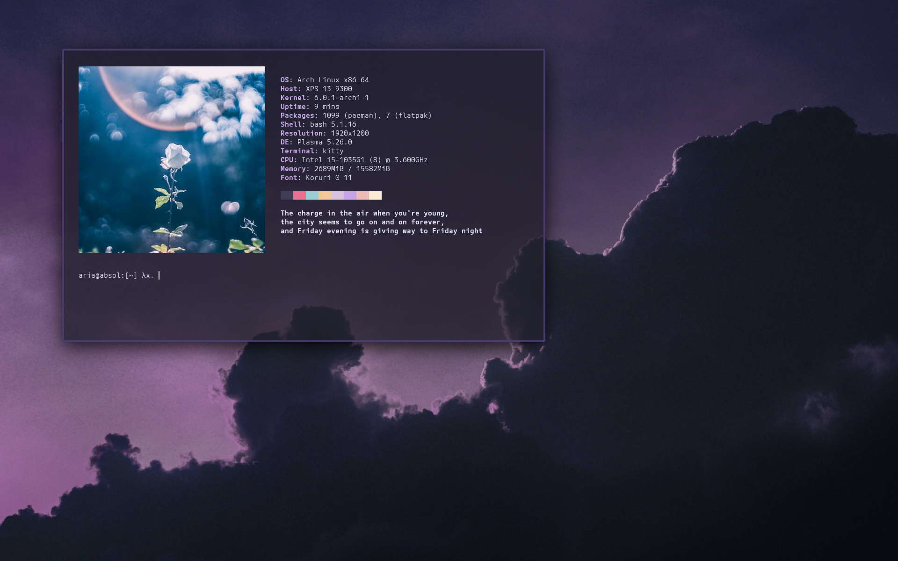
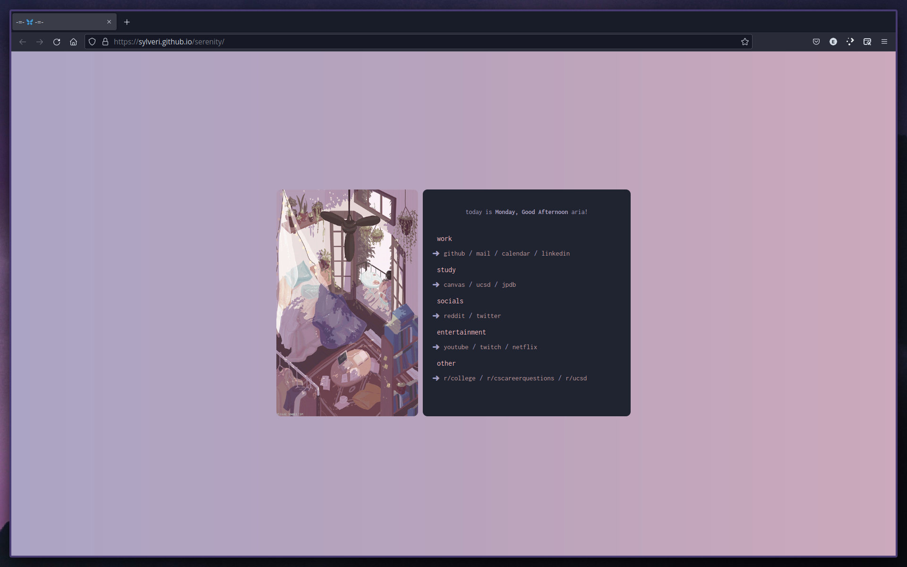

# dotfiles
- distro: arch
- terminal: kitty
- launcher/powermenu: rofi, themes from [here](https://github.com/adi1090x/rofi)
- dock: latte-dock
- tiling manager: bismuth
- lockscreen: betterlockscreen
- pdf viewer: zathura
- system monitor: gotop
- dependency graph: pacwall
- discord theme: [zelk](https://github.com/schnensch0/zelk)
- spotify theme: [sleek](https://github.com/morpheusthewhite/spicetify-themes)
- startpage: [serenity](https://www.reddit.com/r/unixporn/comments/kqu6s1/bspwm_serenity/)  

Image sources: 
[wallpaper](https://www.reddit.com/r/unixporn/comments/kyovpx/comment/gjvg0oa/?utm_source=share&utm_medium=web2x&context=3),
[lockscreen](https://twitter.com/fssn_/status/1356190529390665728),
[flower](https://twitter.com/kogaya7/status/1459816270119899141)

Overarching theme is [rose-pine](https://github.com/rose-pine), discord theme is done through css injection, and spotify is themed with spicetify-cli  
You may need to change some configs to be unique to your system if you want to use any part for yourself

# Screenshots

